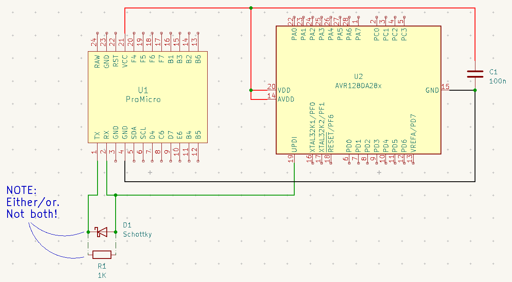
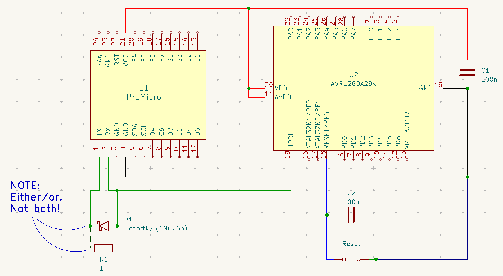

Programming the AVR128Dx
========================

### Contents:

 - [Overview](#protocol)
 - [USB to Serial](#usb-to-serial)
 - [Wiring](#wiring)
 - [Adding a Reset Button](#adding-a-reset-button)


### Protocol

The AVR128Dx series of microcontrollers use a proprietary programming and
debugging interface, UDPI (Unified Programming and Debugging Interface). You can
find detailed specifications in [the datasheet](https://www.microchip.com/en-us/product/avr128da28), but the gist is:

 - one-wire protocol (based on run o' the mill UART)
 - fixed frame format with 8-bits per frame
 - one (even) parity bit
 - two stop bits
 - baud detection via the `SYNCH` frame

There are some other goodies and nuances, but it's a relatively simple protocol
with only a handful of commands for this target architecture.

### Programmers...

Probably, the easiest / most reliable way to program this device is with a
purpose-built programmer and standard tooling...

...in my case, I wanted to get started with what I had lying around and work in a
familiar dev environment (`vim` + `make` + `avr-gcc`), and not wait for anything
to arrive in the mail...

As it turns out, all you need is [`pymcuprog`](https://pypi.org/project/pymcuprog/) and a USB-to-Serial converter — 
which we will adapt to work as a UDPI interface.

For the USB-to-Serial, you have a few options:

 - buy a dedicated converter
 - use another MCU with multiple serial ports (:white_check_mark: this is what I'm doing)
 - use another MCU and bit-bang or else bend another peripheral type into a second serial port

USB to Serial
-------------

In my case, I used an Arduino Pro Micro clone that I had lying around (but any
device with multiple serial ports will work). I don't _normally_ work in the
Arduino IDE or with the Arduino et al libs, _but_, in this case, it's pretty
handy. I created the following "sketch" and uploaded it to my Pro Mini:

```C
// Simple serial passthrough:
// - 115200 baud
// - even parity
// - two stop bits
void setup() {
  Serial.begin(115200, SERIAL_8E2);
  Serial1.begin(115200, SERIAL_8E2);
}

// relay whatever we get on "Serial" to "Serial1" and vice versa:
void loop() {
  if (Serial.available()) {
    Serial1.write(Serial.read());
  }

  if (Serial1.available()) {
    Serial.write(Serial1.read());
  }
}
```

Wiring
------

All we need to do to [make the UART work as a UDPI programmer](https://github.com/microchip-pic-avr-tools/pymcuprog#serial-port-updi-pyupdi) is to put a
Schottky diode from Serial 1 Rx to Tx, like so (if you don't have a Schottky
handy, a 1k resistor can be pressed into service):




Adding a Reset Button
---------------------

To add a **reset** button:
 - add a push-button from pin 18 (`!reset`) to ground
 - put a 100n cap between pin 18 and ground

This is the setup I have:


